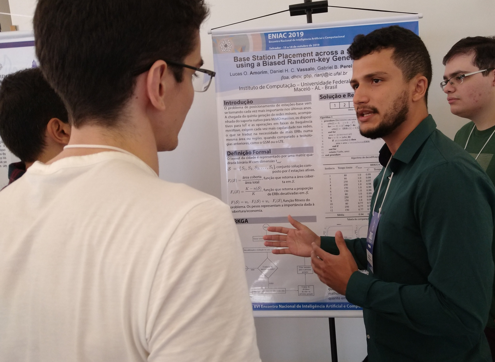

---
# This page uses Hydejack's `about` layout, which shows the primary author's picture and about text at the top.
# You can change it to the regular `page` layout if you want.
layout: about

# The title of the page.
title: About

# Write a short (~150 characters) description of each blog post.
# This description is used to preview the page on search engines, social media, etc.
description: >
  Machine learning, data science, development.

# You can show the description on the page by deleting this line:
hide_description: true

# TODO
image: /assets/img/about-8.png
---

**Gabriel** hails from Maceió-AL. He's a computer technician by the [Federal Institute of Alagoas] and nowadays he's studying computer science at the [Federal University of Alagoas] - Campus A.C. Simões. 
Currently, he's working on [Edge] as a junior developer and on [IC] - Institute of Computation, as a professor assistant of Internet and Web (a Computer Science discipline). 
His main interest areas are *development* and *data science*.

{:.lead}
{:.lead srcset="/assets/img/about/eniac1-8.png 1920w, /assets/img/about/eniac1-8@0,5x.png 960w, /assets/img/about/eniac1-8@0,25x.png 480w" data-width="1920" data-height="1406"}
ENIAC 2019 presentation poster: Base Station Placement across a Simulated City using a Biased Random-key Genetic Algorithm 
{:.figure}

> Below is a little about my experiences and projects, my interests and skills.
{:.lead}

<section class="grid grid-template-columns-2">
	

	    {{"## Experience"| markdownify }}
	    

	    04/2013 - 11/2013
	    
Computational resources for teaching mathematics

	    

            {{"An extension project at the [Federal Institute of Alagoas](https://www2.ifal.edu.br/), with the objective of 
            teaching educational computational resources to public school mathematics teachers. These resources could be 
            applied to improve classroom performance and engage students."| markdownify }}
	    

        08/2017 - 07/2018
        
Intelligent assistants in online education: a focus on discussion forum

        

            {{"A research project at the [Federal University of Alagoas](https://ufal.br/), with the objective of designing 
            and developing intelligent assistants, focusing on the discussion forum resource, building tools to help 
            students and teachers."| markdownify }}
        

        02/2018 - 06/2018
        
Database professor assistant 

        

            {{"Helping the professor of Database (a Computer Science discipline at the [Federal University of 
            Alagoas](https://ufal.br/)), in your classrooms by teaching and helping the students."| markdownify }}
        

        08/2018 - 07/2019
        
A multidimensional approach for personalization in educational resource recommendation 
        systems 

        

            {{"A research project at the [Federal University of Alagoas](https://ufal.br/), with the objective of studying 
            and promoting improvements in the quality of personalized recommendation of digital educational resources or 
            people"| markdownify }}
        

        07/2019 - present
        
Internet and Web professor assistant 

        

            {{"Helping the professor of Internet and Web (a Computer Science discipline at the [Federal University of 
            Alagoas](https://ufal.br/)), in your classrooms by teaching and helping the students."| markdownify }}
        

        07/2019 - present
        
Junior developer at EDGE

        

            {{"[EDGE](http://edgebr.org/) is an innovation center that is part of the Institute of Computing of the Federal
             University of Alagoas (UFAL), in Maceió. Lab leaders have a history of partnering with companies and developing
              research and innovation projects.."| markdownify }}
        

	

	

	    {{"## Languages"| markdownify }}
        

        
Portuguese

        

            
Reading

            
        

        

            
Writing

            
        

        

            
Listening

            
        

        

            
Speaking

            
        

        
English TOEFL - QCE: B1

        

            
Reading

            
        

        

            
Writing

            
        

        

            
Listening

            
        

        

            
Speaking

            
        

        {{"## Skills"| markdownify }}
        

        
Languages

        {{"`C` `C#` `JAVASCRIPT` `JAVA` `PYTHON` `DART` `R`"| markdownify }}
        
Web development

        {{"`HTML` `CSS` `TYPESCRIPT` `ASP.NET MVC` `DJANGO` `DJANGO REST FRAMEWORK` `FLASK` `ANGULAR` `SQL`"| markdownify }}
        
Mobile development

        {{"`IONIC` `FLUTTER`"| markdownify }}
        
Data science

        {{"`PANDAS` `NUMPY` `SCIKIT-LEARN` `KERAS` `TENSORFLOW`"| markdownify }}
        
Others

        {{"`GIT` `VERSION CONTROL` `AGILE METHODOLOGIES` `STATISTICS`"| markdownify }}
	

	

	    {{"## Education"| markdownify }}
        

        

            
Certificate (Technical Course), Computing, Federal Institute of Alagoas

            2011 - 2014. GPA: 3.54 (Brazilian scale: 8.85)
        

        
        
            
B.S., Computer Science, Federal University of Alagoas

            2016 - present. GPA: 3.47 (Brazilian scale: 8.68)
        

	

	

        {{"## Publications"| markdownify }}
        

        2019
        
ENIAC<a href="#fn:1" class="footnote">1</a>

        
{{"Base Station Placement across a Simulated City using a Biased Random-key Genetic Algorithm"| markdownify}}

	

	<!--
	

        {{"## Extra"| markdownify }}
        

        {{"Colocar Aplicativo feito."| markdownify }}
        {{"Colocar Colocar evento ICTechWeek."| markdownify }}
        {{"Colocar Cursos Udemy: Ionic, Flutter, DataScience."| markdownify }}
    

    

        {{"## Interests"| markdownify }}
        

        {{"Colocar as áreas da computação: data science, development, segurança, redes."| markdownify }}
        {{"Colocar as áreas fora da computação: música, sei lá..."| markdownify }}
    

    -->
</section>

## Resume
Get my resume on [Lattes](http://lattes.cnpq.br/1113244252323139){:target="_blank"} or [PDF](assets/Resume.pdf){:target="_blank"}.

{: data-width="1867" data-height="1389"}
Front page of a print resume generated by me.
{:.figure}

  <ol>
    <li id="fn:1" tabindex="0">
      
<a href="http://www.bracis2019.ufba.br/eniac.html" target="_blank"> ENIAC </a>: Encontro Nacional de Inteligência Artificial e Computacional (National Meeting on Artificial and Computational Intelligence).
      It's a brazilian conference about artificial and computational intelligence that occurred in Salvador-BA<a href="#fnref:1" class="reversefootnote">↩︎</a>

    </li>
  </ol>

<!--
* 99/100 [Google PageSpeed Score][gpss][^1]

[^1]: Actual page load speed depends on your hosting provider, resolution of embedded images and usage of 3rd party plugins.
-->

[edge]: http://edgebr.org/
[ic]: http://www.ufal.edu.br/unidadeacademica/ic
[Federal Institute of Alagoas]: https://www2.ifal.edu.br/
[Federal University of Alagoas]: https://ufal.br/
<!---->
[blog]: https://hydejack.com/blog/
[portfolio]: https://hydejack.com/projects/
[resume]: https://hydejack.com/resume/
[download]: https://hydejack.com/download/
[welcome]: https://hydejack.com/
[forms]: https://hydejack.com/forms-by-example/

[features]: #features
[news]: #build-an-audience
[syntax]: #syntax-highlighting
[latex]: example/_posts/2018-06-01-example-content-iii.md#math

[lic]: https://hydejack.com/LICENSE/
[pro]: https://hydejack.com/licenses/PRO/
[docs]: https://hydejack.com/docs/

[kit]: https://github.com/qwtel/hydejack-starter-kit/archive/master.zip
[src]: https://github.com/qwtel/hydejack
[gem]: https://rubygems.org/gems/jekyll-theme-hydejack
[buy]: https://app.simplegoods.co/i/NATYVLYT
[nfy]: https://app.netlify.com/start/deploy?repository=https://github.com/qwtel/hydejack-starter-kit
[dtn]: https://www.netlify.com/img/deploy/button.svg

[gpss]: https://developers.google.com/speed/pagespeed/insights/?url=https%3A%2F%2Fhydejack.com%2F
[hy-push-state]: https://qwtel.com/hy-push-state/
[hy-drawer]: https://qwtel.com/hy-drawer/
[hy-img]: https://qwtel.com/hy-img/
[rouge]: http://rouge.jneen.net
[katex]: https://khan.github.io/KaTeX/
[tinyletter]: https://tinyletter.com/

*[FLIP]: First-Last-Invert-Play. A coding technique to achieve performant page transition animations.
