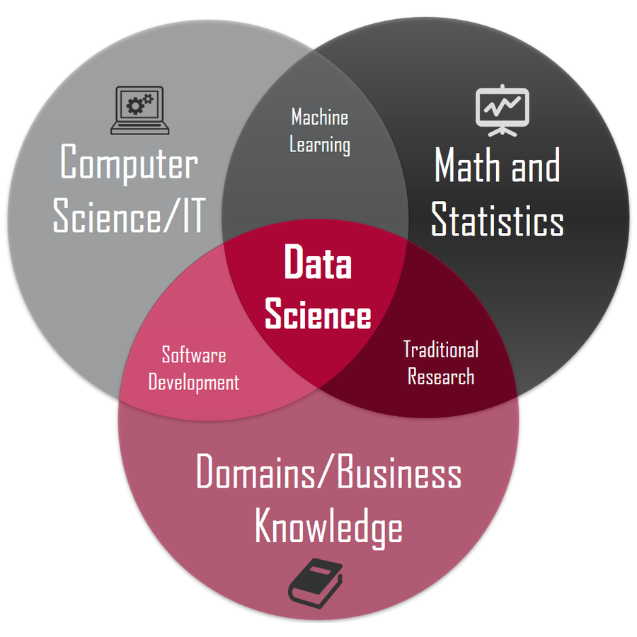

    

       
       

         <h4>Data Science</h4>
         
Data science is the field of study that combines domain expertise, programming skills, and knowledge of 
         mathematics and statistics to extract meaningful insights from data.

       

    

    

       
       

         <h4>News</h4>
         
Here are the news and curiosities of the Computer Science world.

       

    

